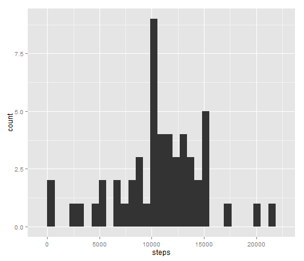
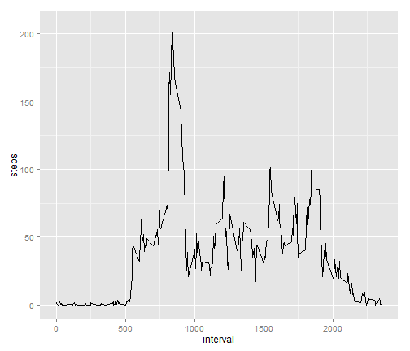
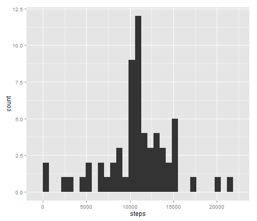
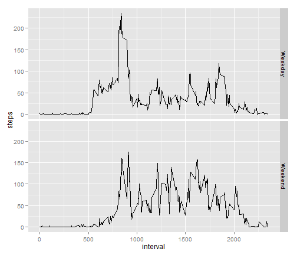

# Reproducible Research: Peer Assessment 1
========================================================

This report records the analysis conducted as part of Peer Assessment 1 of the Coursera Rerproducible Research course. This analysis works with the Activity Monitoring data set, which records data at 5 minute intervals through out the day. The data consists of two months of data from an anonymous individual collected during the months of October and November, 2012 and include the number of steps taken in 5 minute intervals each day. These data can be downloaded here: https://d396qusza40orc.cloudfront.net/repdata%2Fdata%2Factivity.zip


## Loading and preprocessing the data
We start by reading in the data set. This code assumes that the data have already been downloaded and reside in your working directory.

```r
rawData <- read.csv("activity.csv")

head(rawData)
```

```
##   steps       date interval
## 1    NA 2012-10-01        0
## 2    NA 2012-10-01        5
## 3    NA 2012-10-01       10
## 4    NA 2012-10-01       15
## 5    NA 2012-10-01       20
## 6    NA 2012-10-01       25
```

```r
summary(rawData)
```

```
##      steps               date          interval   
##  Min.   :  0.0   2012-10-01:  288   Min.   :   0  
##  1st Qu.:  0.0   2012-10-02:  288   1st Qu.: 589  
##  Median :  0.0   2012-10-03:  288   Median :1178  
##  Mean   : 37.4   2012-10-04:  288   Mean   :1178  
##  3rd Qu.: 12.0   2012-10-05:  288   3rd Qu.:1766  
##  Max.   :806.0   2012-10-06:  288   Max.   :2355  
##  NA's   :2304    (Other)   :15840
```

```r
str(rawData)
```

```
## 'data.frame':	17568 obs. of  3 variables:
##  $ steps   : int  NA NA NA NA NA NA NA NA NA NA ...
##  $ date    : Factor w/ 61 levels "2012-10-01","2012-10-02",..: 1 1 1 1 1 1 1 1 1 1 ...
##  $ interval: int  0 5 10 15 20 25 30 35 40 45 ...
```
Looking at the raw data, the only change that seems necessary is to convert the date variable to a date format (instead of a factor). We create a new analysis data set with this change.


```r
analysisData <- rawData

analysisData$date <- as.Date(rawData$date)
```

## What is mean total number of steps taken per day?
We then calculate the calculate statistics on the steps per day. These statistics ignore missing values for the time being.

We start by creating a dataset of total steps per day.

```r
library(plyr)
```

```
## Warning: package 'plyr' was built under R version 3.0.3
```

```r
stepsPerDay<- aggregate(steps ~ date,data=analysisData,sum)
```


We then create a histogram of steps per day:


```r
library(ggplot2)
```

```
## Warning: package 'ggplot2' was built under R version 3.0.3
```

```r
qplot(steps, data=stepsPerDay, type ="histogram")
```

```
## stat_bin: binwidth defaulted to range/30. Use 'binwidth = x' to adjust this.
```

 

We also report the mean and median steps per day:

```r
mean(stepsPerDay$steps)
```

```
## [1] 10766
```

```r
median(stepsPerDay$steps)
```

```
## [1] 10765
```


## What is the average daily activity pattern?

In order to look at the average activity pattern, we start by creating a dataset of average steps per interval. 

```r
stepsPerInterval<- aggregate(steps ~ interval,data=analysisData,mean)
```


We then create a line plot of average steps per interval:


```r
p <- ggplot(stepsPerInterval,aes(interval,steps)) 
p+ geom_line()
```

 

## Imputing missing values

In exploring a method for imputing missing values, we first count the number of NAs:

```r
sum(is.na(analysisData$steps))
```

```
## [1] 2304
```

It looks like 2,304 out of 17,568 records are missing. Not a neglible amount, working out to 13%. 

```r
sum(is.na(analysisData$steps))/length(analysisData$steps)
```

```
## [1] 0.1311
```

We then create an imputed data set. The imputation scheme we opt for is simply mean values per interval. 

```r
names(stepsPerInterval)[2] <- "meanSteps"

imputedAnalysisData <- merge(analysisData,stepsPerInterval,all=TRUE)

imputedAnalysisData$steps[is.na(imputedAnalysisData$steps)] <- imputedAnalysisData$meanSteps[is.na(imputedAnalysisData$steps)] 

imputedAnalysisData <-imputedAnalysisData[with(imputedAnalysisData,order(date,interval)),]
```


We then calculate the calculate statistics on the steps per day. These statistics include the imputed values.

We start by creating a dataset of total steps per day with the imputed data.

```r
imputedStepsPerDay<- aggregate(steps ~ date,data=imputedAnalysisData,sum)
```


We then create a histogram of the imputed steps per day:


```r
qplot(steps, data=imputedStepsPerDay, type ="histogram")
```

```
## stat_bin: binwidth defaulted to range/30. Use 'binwidth = x' to adjust this.
```

 

We also report the mean and median steps per day and compare to the raw data:

```r
mean(imputedStepsPerDay$steps)
```

```
## [1] 10766
```

```r
median(imputedStepsPerDay$steps)
```

```
## [1] 10766
```

```r
mean(imputedStepsPerDay$steps) - mean(stepsPerDay$steps)
```

```
## [1] 0
```

```r
median(imputedStepsPerDay$steps) - median(stepsPerDay$steps)
```

```
## [1] 1.189
```
It looks like it doesn't make any difference to the mean value, but the median is ever so slightly off...

## Are there differences in activity patterns between weekdays and weekends?
In order to discern a pattern between weekend and weekday, we first create a factor to indicate day type.


```r
analysisData$weekday <- as.factor(ifelse(weekdays(analysisData$date) %in% c("Saturday","Sunday"), "Weekend","Weekday"))
```


We then creat a dataset of average steps per interval, grouped by day type. 

```r
stepsPerIntervalByDay<- aggregate(steps ~ interval + weekday,data=analysisData,mean)
```

We then create a line plot of average steps per interval:


```r
p <- ggplot(stepsPerIntervalByDay,aes(interval,steps)) 
p+ geom_line() +facet_grid(weekday~.)
```

 
